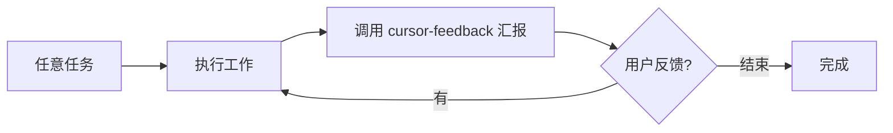
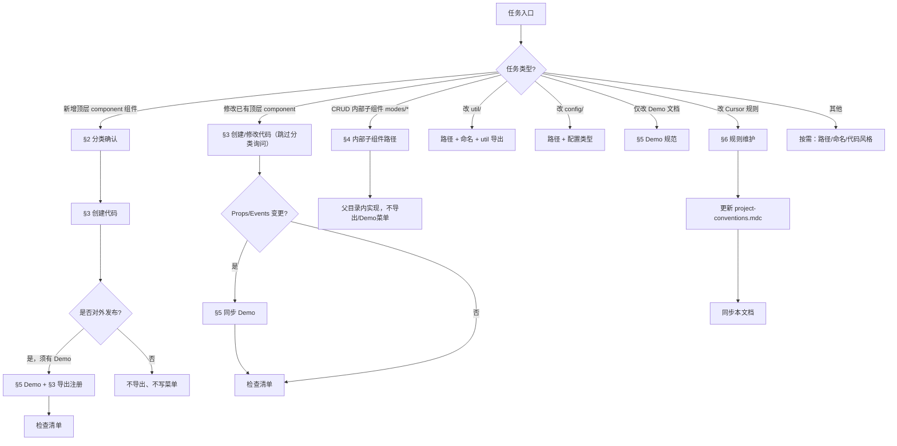
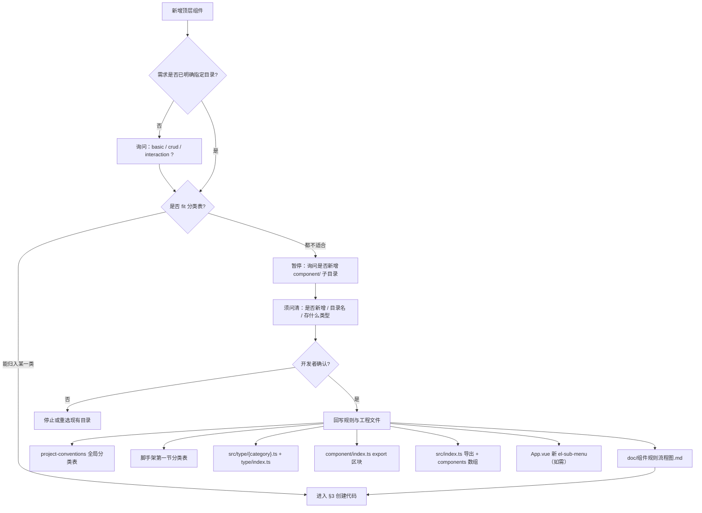
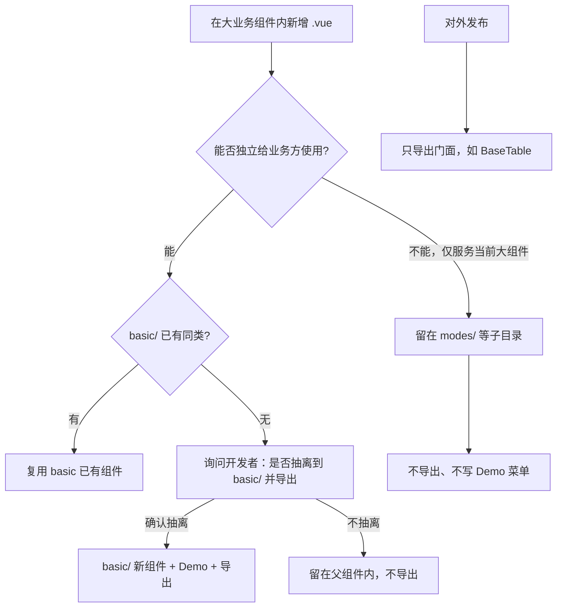
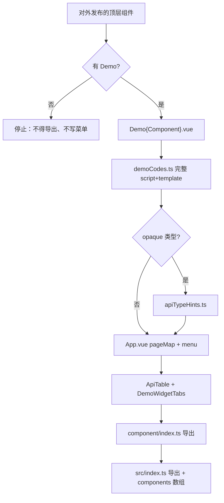
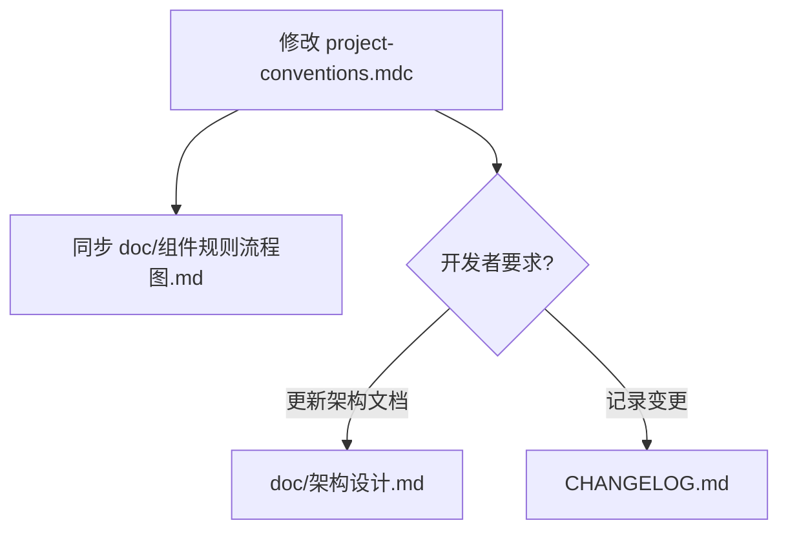

# 组件规则流程图

> 本文档是 `.cursor/rules/project-conventions.mdc` 的流程可视化。修改规则后须同步更新本文档。

## 0. 元流程：Cursor Feedback



---

## 1. 任务入口分流

### 方案 A（旧，已废弃）

```
不涉及 component/ → 笼统走「全局规范：路径/风格/三端/npm」
```

问题：三端/风格应在**写组件 UI 时**才需要，不应挂在「不涉及 component」上。

### 方案 B（现行）



---

## 2. 分类确认（仅新增顶层组件）

当前 `component/` 子目录以 `project-conventions.mdc`「组件分类（全局）」表格为准：`basic/`、`crud/`、`interaction/`。

> **说明**：不存在 AI 运行时读取的独立子目录配置文件；新增目录后须**回写** `project-conventions.mdc` 表格，规则才生效。



`doc/架构设计.md`、`CHANGELOG.md` **不在此流程自动更新**，仅开发者明确要求时维护。

---

## 3. 创建 / 修改代码

```mermaid
flowchart TD
    A[编写或修改组件] --> B[路径引用 @/ alias]
    B --> C[script setup + Composition API]
    C --> D[类型写入 src/type/{category}.ts]
    D --> E[SCSS 使用 variables.scss $lib-*]
    E --> F[三端断点 tablet / mobile]
    F --> G{能否独立给业务方使用?}
    G -->|能，且 basic 无同类| H["询问是否抽离到 basic/"]
    G -->|不能| I[继续]
    H --> I
```

---

## 4. 大业务组件内部件 vs 可抽离小组件

**判断标准**：该 Vue 文件能否作为**通用小组件**单独给业务方使用？



示例：`BaseTableElement` 等五种模式 **不能** 独立使用 → 留 `modes/`，不导出。若某 Cell 组件 **可以** 单独复用 → 询问是否进 `basic/`。

---

## 5. Demo 同步 + 导出注册



---

## 6. Cursor 规则维护



---

## 硬约束速查

| 场景 | 行为 |
|------|------|
| 新增顶层组件，分类不明 | 必须询问，不得默认 `interaction/` |
| 修改已有顶层组件 | 跳过分类询问 |
| 三者均不适合 | 暂停，询问是否新增目录 |
| 新增目录后 | 回写规则表 + type/index/component/index/src/index/流程图 |
| CRUD 内部件 | 不能独立使用 → 父目录内，不导出 |
| 大业务组件 | 只导出门面（如 BaseTable） |
| 可独立小组件 | basic 无同类 → 询问是否抽离到 basic |
| 无 Demo | 不得对外发布 |
| 架构/CHANGELOG | 仅开发者明确要求时更新 |
| 改 Cursor 规则 | 同步本文档 |
